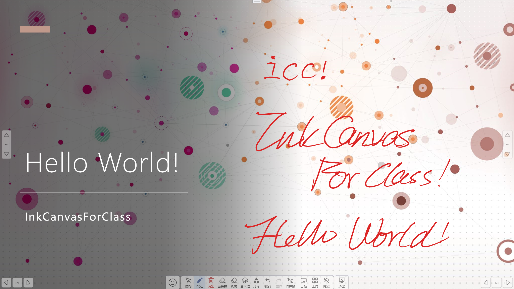
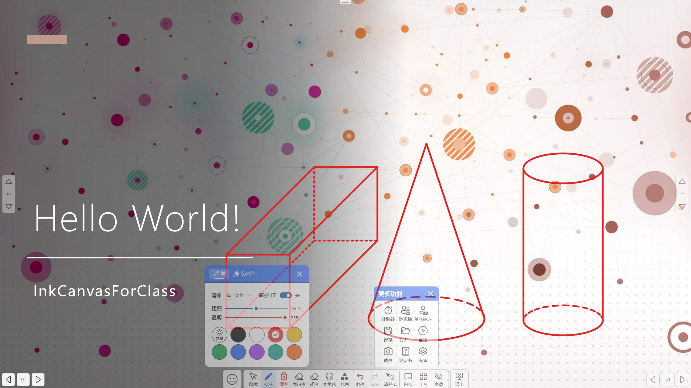

# InkCanvasForClass-Remastered

## 项目介绍

本项目基于 `icc-0610fix` 进行二次开发，而 `icc-0610fix` 是 **InkCanvasForClass**（简称 **ICC**）的一个衍生版本。

> `icc-0610fix` 原仓库: [awesome-iwb/icc-20240610-stable](https://github.com/awesome-iwb/icc-20240610-stable)。  
> **ICC** 本身源自 [WuChanging/Ink-Canvas](https://github.com/WuChanging/Ink-Canvas)，该项目对原版做了大量改进，包括 UI 美化、新增功能与体验优化。  
> 进一步追溯， [WuChanging/Ink-Canvas](https://github.com/WuChanging/Ink-Canvas)（又名 *Ink Canvas Artistry*）基于 [WXRIW/Ink-Canvas](https://github.com/WXRIW/Ink-Canvas) 修改，继续完善了功能与界面。

由于 **ICC** 原开发者已停止维护，最新分支不可用，加之多个项目层层叠加导致代码质量下降，本项目选择在一个较受欢迎且可用的 **ICC** 版本基础上，开展**代码重构与现代化**工作。对此，开发重心不在新功能的增加上，而是底层重构上，甚至会移除功能。

### 为什么叫 Remastered

“Remastered” 表示本项目的目标是采用现代 .NET 技术对代码进行**去屎山化**与优化，提升可维护性与使用体验。    
为了保持项目整洁，我选择新建仓库而不是直接 fork，所以没有原始 commit 历史。

### 致谢

感谢原项目及上游贡献者的努力：  

点击展开

https://github.com/WXRIW  
https://github.com/WuChanging  
https://github.com/douxiba  
https://github.com/Raspberry-Monster  
https://github.com/Kengwang  
https://github.com/jiajiaxd  
https://github.com/clover-yan  
https://github.com/NetheriteBowl  
https://github.com/NotYoojun  
https://github.com/STBBRD  
https://github.com/aaaaaaccd  
https://github.com/Alan-CRL  
https://github.com/3382308510  

（后续文档和软件内只会列出本仓库直接贡献者）

## 项目说明

社区另有维护更积极的衍生版 [InkCanvasForClass Community Edition](https://github.com/InkCanvasForClass/community)（ICC-CE），推荐各位都去用这个，ICC-Re只是我闲暇之余有兴趣才会开发。  
不过我不太喜欢 ICC-CE，所以本项目应运而生。

1. 项目以个人兴趣为主开发，**而且用的人肯定是几乎没有**，所以更新随缘，优先保证基本可用性，bug修复。功能的新增较少。
2. 目前版本应该是可以正常使用，应该是无严重 bug，后续更新会尽量不引入新的屎。
3. **本项目的初始提交**相较 `icc-0610fix` 的主要变化：
> commit可以去看我的fork仓库 https://github.com/LiuYan-xwx/icc-0610fix/commits/master/
   - **移除功能：**
     - 墨迹识别（因为我用不到）
     - 白板鸡汤提示
     - 自动更新
   - **Bug修复**
     - 修复 PPT 翻页按钮不显示的问题
     - 修复鼠标指针会隐藏的问题  
   - **技术升级：**
     - 从 `.NET Framework 4.7.2` 升级至 `.NET 8`，以及必要的兼容性修改
     - 升级了 Nuget 各种库，以及必要的兼容性修改
   - **其他优化：**
     - 随机点名有些许修改

**本项目基于 GPLv3 许可**

## 开发
目前在 **wtf** 分支开发。~~*别问为什么叫这个()*~~

**本项目建立后**已经做出的常规修改：
- 使用了新的 ICC-Re 图标，各种名字也改了
- 开发者栏目修改
- 移除了侧边栏的快速面板
- 不默认开机自启
- 移除白板的新页面按钮，下一页不够会自动加

技术性修改：
- 移除了所有 COM 引用
- 开机自启创建快捷方式由COM引用方式改用 [WindowsShortcutFactory](https://github.com/gdivis/WindowsShortcutFactory)
- 各种 System.Timers.Timer 重构为 DispatcherTimer
- 自动收纳的代码实现重构
- ISettingsService，可以LoadSettings, SaveSettings, ReplaceSettings。code-behind中相应逻辑删除
- IPowerPointService，各种方法。code-behind中连接ppt的逻辑全部挪到这
- MainViewModel ~~（还在写）~~（暂缓，慢慢写）
- 移除无用的白板ui xaml，使用视图模型和转换器自动处理翻页按钮的样式

更改写这么详细只是为了激励自己继续开发，别说我为了看着唬人才这么写实际上没什么更改，我只能说我还不希望你们用 ICC-Re。

---

## 以下为原项目 README

点击展开

# icc-0610fix

Elegant by Default. Based on `ChangSakura/InkCanvas` .

**這將會是最後一次基於InkCanvas控件的倔強**

## 公告
该项目皆在基于 旧版 InkCanvasForClass 的基础上进行维护和修复。该项目将于2025年2月16日恢复维护。

## 前言
使用和分發本軟體前，請您應當且務必知曉相關開源協議，本軟體基於 https://github.com/ChangSakura/Ink-Canvas 修改而成，而ICA又基於 https://github.com/WXRIW/Ink-Canvas 修改而成，增添了包括但不限於隱藏到側邊欄等功能，更改了相關UI和軟體操作邏輯。對於墨跡書寫功能以及ICA獨有功能的相關 issue 提出，應優先查閱 https://github.com/WXRIW/Ink-Canvas/issues 。

[直接下載](https://gitea.bliemhax.com/kriastans/InkCanvasForClass/releases "Latest Releases")
——以壓縮檔案形式存儲，便攜版可直接啟動，默認配置適配絕大多數紅外觸摸框的設置。

> ⚠️注意：此項目仍在開發中，只會在發佈正式發行版時提供Release。您可以自行使用VS2022編譯打包後自行使用

## 特性
1. Support Active Pen (支持壓感)
2. 工具欄顯示了每個功能的文字描述
3. 添加了調色盤的顏色
4. 添加了熒光筆支持

## 提示
- 對新功能的有效意見和合理建議，開發者會適時回復並進行開發。本軟體並非商業性質軟體，請勿催促開發者，耐心才能讓功能更少 BUG、更加穩定。
- 此軟體僅用於私人使用，請勿商用。更新也不會很快，如果有能力請PR貢獻程式碼而不是在Issue裡面提問題。
- 歡迎您使用InkCanvas家族的其他成員，包括ICC和ICA的創始者IC以及和ICC差不多的ICA。您的大力宣傳能夠幫助我們的軟件被更多的用戶發現。

## FAQ

### 點擊放映後一翻頁就閃退？
考慮是由於`Microsoft Office`未啟用導致的，請自行啟用

### 放映後畫板程序不會切換到PPT模式？
如果你曾經安裝過`WPS`且在卸載後發現此問題則是由於暫時未確定的問題所導致，可以嘗試重新安裝WPS
> “您好，關於您回饋的情況我們已經回饋技術同學進一步分析哈，辛苦您可以留意後續WPS版本更新哈~” --回復自WPS客服

另外，處在保護（只讀）模式的PPT不會被識別

若因安裝了最新版本的 WPS 而導致無法在 WPS 軟體內進入 PPT 模式，可以嘗試卸載 WPS 後，並清除電腦垃圾、註冊表垃圾、刪除電腦上所有帶 "kingsoft" 名稱的文件夾，重新安裝 WPS 後，（以上步驟可能有多餘步驟），經測試在 WPS 內可以正常進入 PPT 模式。

ICC 可以支持 WPS，但目前無法同時支持 MSOffice 和 WPS。若要啟用 WPS 支持，請確保 WPS 是否在 “配置工具” 中開啟了 “WPS Office 相容第三方系統和軟體” 選項，該項目勾選並應用後，將無法檢測到 MS Office 的COM接口。

如果您安裝了“贛教通”、“暢言智慧課堂”等應用程式，可能會安裝“暢言備課精靈”，可能會導致遺失64為Office COM組建的註冊且目前似乎無法修復（可以切換到新用戶正常使用）。但 WPS Office 可以正常使用。

若要將 ICC 配合 WPS 使用，可打開“WPS 示範”後，前往“文件” - “選項” ，取消勾選“單螢幕幻燈片放映時，顯示放映工具欄”該項，獲得更好的體驗。若要將 ICC 配合 MS Office 使用，可以打開 Powerpoint，前往“選項” ，“高級”，取消勾選“顯示快捷工具欄”，獲得更好的體驗。

### **安裝後**程序無法正常啟動？
請檢查你的電腦上是否安裝了 `.Net Framework 4.7.2` 或更高版本。若沒有，請前往官網下載  

> 遇到各種奇葩逗比問題請重啟應用程式，如果不行請反饋給Dev解決！

## 特別鳴謝

<table>
    <tbody>
        <tr>
            <td align="center" valign="top" width="14.28%"><a href="https://bgithub.xyz/ChangSakura"> <b>ChangSakura</b></a></td>
            <td align="center" valign="top" width="14.28%"><a href="https://bgithub.xyz/WXRIW"> <b>WXRIW</b></a></td>
            <td align="center" valign="top" width="14.28%"><a href="https://bgithub.xyz/Alan-CRL"> <b>Alan-CRL</b></a></td>
        </tr>
    </tbody>
</table>

## 使用
- 安装 [.NET 8 桌面运行时](https://dotnet.microsoft.com/en-us/download/dotnet/8.0)  
- 自行构建软件后使用
- 或直接从 GitHub Actions 下载构建产物，大概不会发 Release

## 问题反馈

常见问题可参考原 README FAQ 部分，懒得写了；遇到新问题可开 Issue 反馈。

## 致谢
本项目使用了以下第三方库：
- ...
- ...

## 贡献者
还没有
